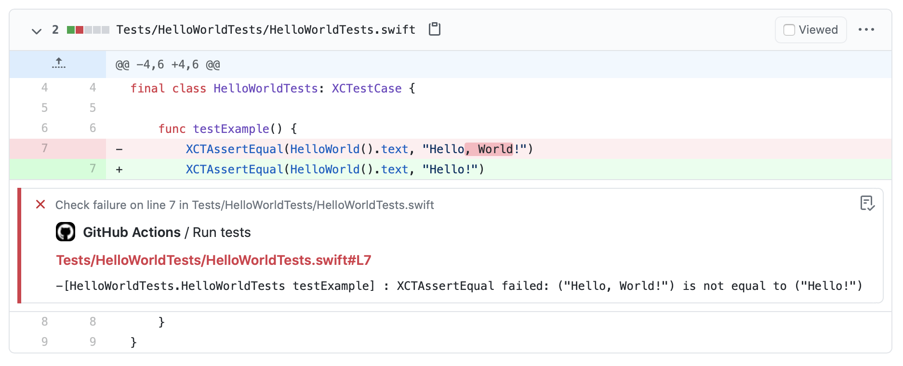

# XCAudit

[](https://github.com/Alexander-Ignition/XCAudit/actions/workflows/test.yml)
[](https://swift.org/package-manager)
[](https://developer.apple.com/swift)
[](https://github.com/Alexander-Ignition/XCAudit/blob/master/LICENSE)

Audit Xcode build logs for GitHub Actions

[Example PR](https://github.com/Alexander-Ignition/XCAudit-Example/pull/2/files)



## Requirements

- Swift 5.3
- macOS 10.15

## Example Workflow

```yml
# .github/workflows/test.yml

name: Test
on:
  push:
    branches:
      - main
    tags-ignore:
      - '**'
  pull_request:
    branches:
      - '**'

jobs:
  test:
    name: Run tests
    runs-on: macOS-latest
    steps:
      - name: Checkout
        uses: actions/checkout@v2
      - name: Install xcaudit
        uses: Alexander-Ignition/XCAudit@main
      - name: Build and test
        run: swift test --enable-code-coverage --disable-automatic-resolution 2>&1 | xcaudit
        shell: bash
```

## License

MIT
